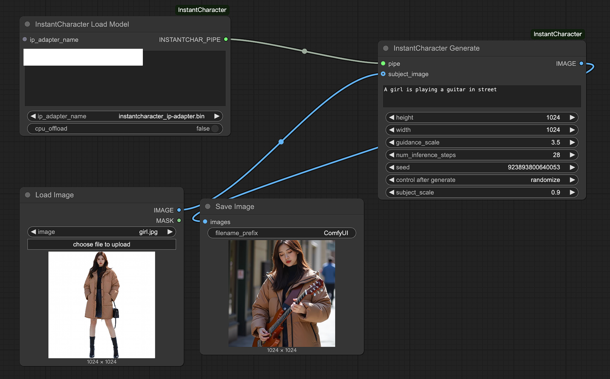

# ComfyUI-InstantCharacter

ComfyUI-InstantCharacter 

https://github.com/Tencent/InstantCharacter
ComfyUI Warpper

now Need 45GB VRAM, (now open offload will error, fix offload and open it will run on 24GB VRAM.)

flux model & image encoder will autodownload

    flux model donwload to models/unet 

    image encoder download to models/clipvision

ipadapter need download to models/ipadapter

https://huggingface.co/tencent/InstantCharacter/blob/main/instantcharacter_ip-adapter.bin

## Paper Analysis

**Analysis of the Paper "Instant Character: Personalize Any Characters with a Scalable Diffusion Transformer Framework"**

This paper introduces InstantCharacter, a novel framework that marks significant progress in personalized character image generation, particularly by leveraging powerful Diffusion Transformer (DiT) models like FLUX.1. Its goal is to generate high-quality images of a specific character provided by the user (via a reference image) in various new scenarios, poses, and styles described by text prompts, all while maintaining high character identity consistency and precise adherence to the text instructions.

**Comparative Analysis Against Related Methods:**

The paper qualitatively compares InstantCharacter against other personalization methods also built upon the FLUX foundation, highlighting its advantages:

*   **Vs. OminiControl and EasyControl:** These methods struggle significantly with maintaining **character identity consistency**. The generated characters often show noticeable differences from the reference image, failing to effectively preserve key identity features.
*   **Vs. ACE++:** While slightly better at identity preservation, ACE++ only maintains partial features, particularly in simple scenarios. Its primary weakness lies in **text controllability**, especially when dealing with complex, action-oriented prompts, often resulting in inaccurate or unnatural outputs.
*   **Vs. UNO:** UNO excels at **identity consistency**, but often *over-preserves* it. This comes at the cost of reduced **editability**. It finds it difficult to flexibly alter the character's pose or actions according to the text prompt or to integrate the character naturally into new backgrounds, sometimes resembling a simple "copy-paste" effect.
*   **InstantCharacter's Advantages:** In contrast, InstantCharacter achieves an excellent balance between **identity consistency**, **text controllability** (especially for complex actions and scene integration), and overall **image fidelity**. It reliably "remembers" the character's appearance while flexibly and accurately creating high-quality images based on text instructions, even for complex prompts like "a character riding a bicycle" or "playing the piano in a specific location." Experiments show its performance surpasses the aforementioned open-source methods and is comparable to the powerful, closed-source GPT4o. Furthermore, InstantCharacter demonstrates good compatibility with style LoRAs, enabling stylized character generation easily.

**Key Factors Behind InstantCharacter's Success:**

InstantCharacter's outstanding performance stems from the synergistic combination of several critical elements:

1.  **Scalable Adapter Specifically Designed for DiTs:** Unlike traditional adapters often meant for U-Nets, InstantCharacter employs a full Transformer architecture that is highly compatible with the underlying DiT model (FLUX). This ensures efficient interaction and information flow. Its design is inherently scalable to match future, more powerful DiTs. It effectively injects character features into the DiT's generation process using a timestep-aware Q-former and cross-attention mechanisms.
2.  **Advanced and Robust Character Feature Extraction:**
    *   It utilizes a combination of **SigLIP** (for fine-grained details crucial for identity) and **DINOv2** (for robust features resistant to background noise) instead of relying on a single encoder, providing more comprehensive and reliable character appearance information.
    *   A **multi-level feature fusion** strategy is employed. It processes both low-level features from shallow encoder layers and region-level features obtained via patching, using dedicated intermediate encoders before fusion. This ensures that features across different scales are captured and utilized, minimizing information loss.
3.  **Large-Scale Structured Dataset:** A massive dataset containing 10 million samples of diverse characters was curated. Crucially, it includes both **paired** data (character image + target text description) and **unpaired** data (single character image), providing the foundation for the specialized training strategy.
4.  **Progressive, Decoupled Training Strategy:** An innovative three-stage training approach effectively decouples the sometimes conflicting objectives of **character consistency**, **text controllability**, and **image fidelity** by focusing on them in different phases:
    *   *Stage 1 (Low-res, Unpaired):* Focuses on learning **character consistency**.
    *   *Stage 2 (Low-res, Paired):* Focuses on learning **text controllability**.
    *   *Stage 3 (High-res, Mixed):* Fine-tunes using high-resolution data to enhance **image fidelity** and texture details.
    This strategy is not only effective but also improves training efficiency by handling major learning tasks at lower resolutions.

**Conclusion:**

The success of InstantCharacter is not attributed to a single breakthrough but to the systematic integration of a powerful DiT foundation, a bespoke adapter architecture, intelligent feature extraction techniques, a vast and structured dataset, and a meticulously designed training strategy. This comprehensive approach allows it to set a new benchmark in personalized character generation, particularly in balancing identity preservation, text control, and image quality. It offers significant contributions to the field of controllable image generation, especially for DiT-based applications, and provides valuable insights for adapting foundation models to specialized tasks.

