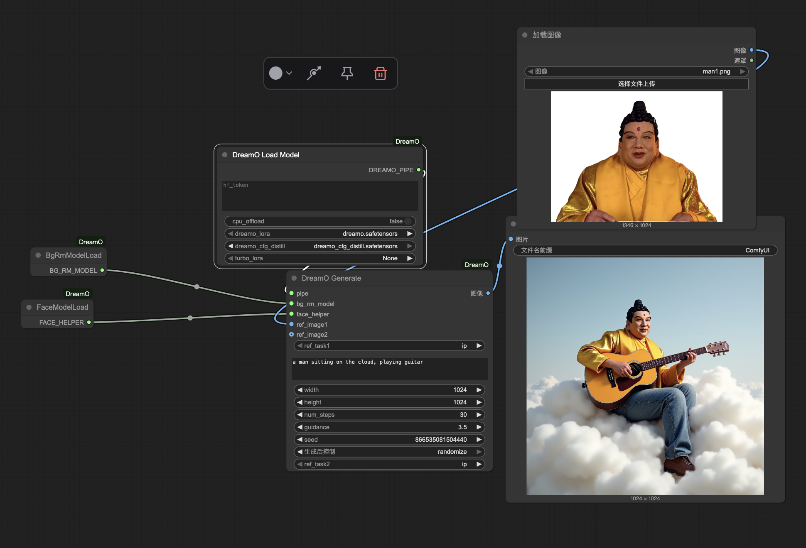
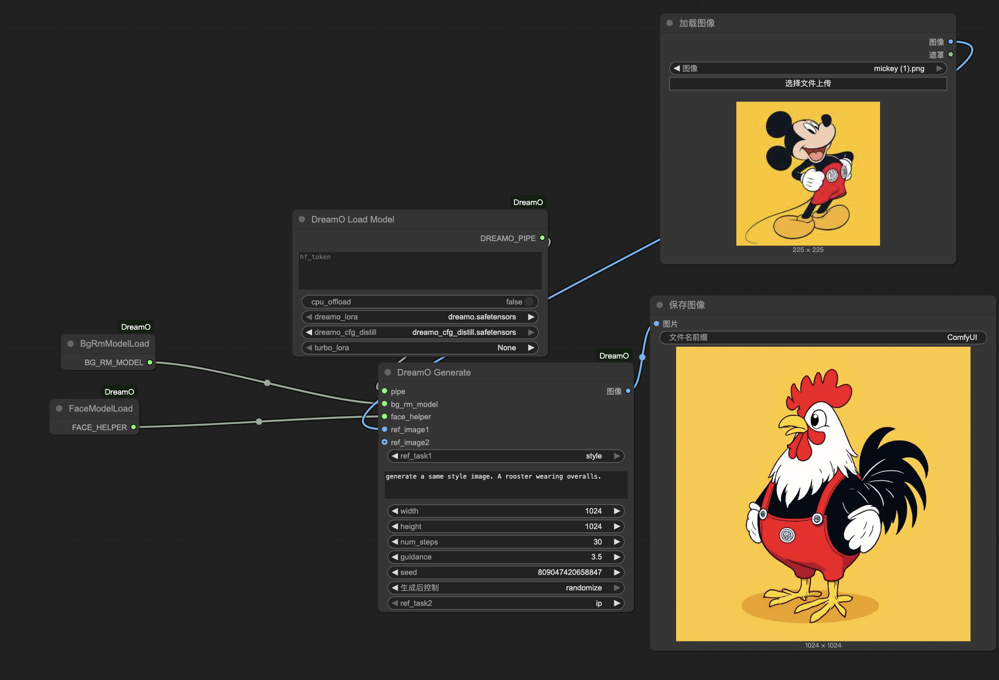
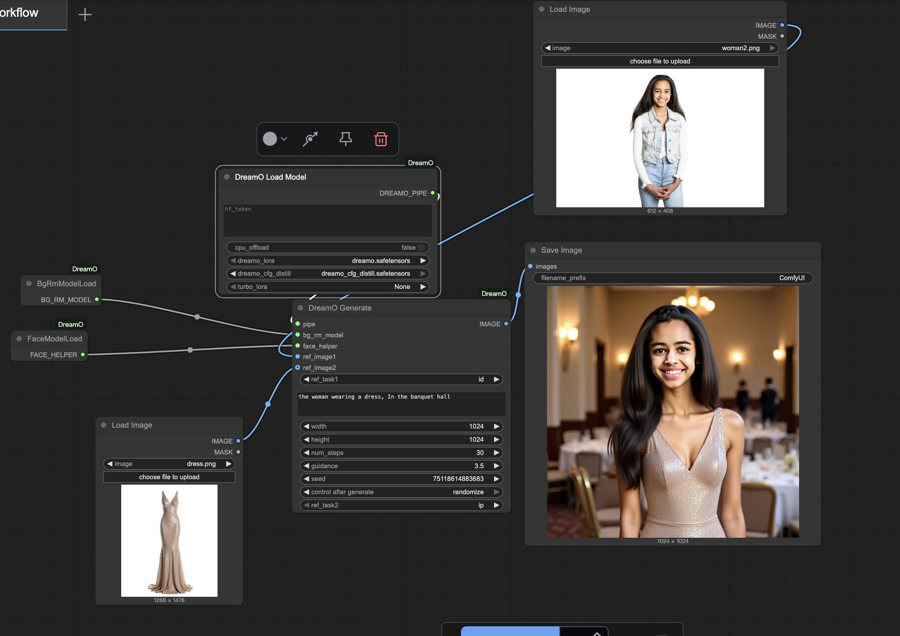

```bash
comfy launch -- --listen 0.0.0.0

wget https://huggingface.co/ByteDance/DreamO/resolve/main/dreamo.safetensors

wget https://huggingface.co/ByteDance/DreamO/resolve/main/dreamo_cfg_distill.safetensors

cp dreamo*.safetensors ComfyUI/models/loras

huggingface-cli login

in file ComfyUI-DreamO.nodes.comfy_nodes.py
#login(token=hf_token)
or 
past in DreanO Load Model node
```

### vim run_xiang_card.py
```python
import os
import time
import subprocess
from pathlib import Path

# Configuration
SEED = 661695664686456
IMAGE_PATH = 'xiang_image.jpg'
STYLE_IMAGE_PATH = '31UR1xM3MWL._AC_UF894,1000_QL80_.jpg'
OUTPUT_DIR = 'ComfyUI/output'
PYTHON_PATH = '/environment/miniconda3/bin/python'

def get_latest_output_count():
    """Return the number of PNG files in the output directory"""
    try:
        return len(list(Path(OUTPUT_DIR).glob('*.png')))
    except:
        return 0

def wait_for_new_output(initial_count):
    """Wait until a new PNG file appears in the output directory"""
    timeout = 60  # seconds
    start_time = time.time()

    while time.time() - start_time < timeout:
        current_count = get_latest_output_count()
        if current_count > initial_count:
            time.sleep(1)  # additional 1 second delay
            return True
        time.sleep(0.5)
    return False

def generate_script(seed):
    """Generate the ComfyUI script with the given seed"""
    script_content = f"""from comfy_script.runtime import *
load()
from comfy_script.runtime.nodes import *
with Workflow():
    dreamo_pipe = DreamOLoadModel('', True, 'dreamo.safetensors', 'dreamo_cfg_distill.safetensors', 'None')
    bg_rm_model = BgRmModelLoad()
    face_helper = FaceModelLoad()
    image, _ = LoadImage('{IMAGE_PATH}')
    image2, _ = LoadImage('{STYLE_IMAGE_PATH}')
    image3 = DreamOGenerate(dreamo_pipe, bg_rm_model, face_helper, image,
        'id', 'a man hold a blank wooden sign', 1024, 1024, 30, 10, {seed}, image2, 'ip')
    SaveImage(image3, 'ComfyUI')
"""
    return script_content

def main():
    # Ensure output directory exists
    os.makedirs(OUTPUT_DIR, exist_ok=True)

    # Main generation loop
    while True:
        # Generate script with current seed
        script = generate_script(SEED)

        # Write script to file
        with open('run_dreamo_generation.py', 'w') as f:
            f.write(script)

        # Get current output count before running
        initial_count = get_latest_output_count()

        # Run the script
        print(f"Generating image with seed: {SEED}")
        subprocess.run([PYTHON_PATH, 'run_dreamo_generation.py'])

        # Wait for new output
        if not wait_for_new_output(initial_count):
            print("Timeout waiting for new output. Continuing to next generation.")

        # Increment seed for next generation
        SEED -= 1

if __name__ == "__main__":
    main()

```
### vim run_xiang_guitar.py
```python

import os

os.environ['HF_ENDPOINT'] = 'https://hf-mirror.com'

import time
import subprocess
from pathlib import Path
from datasets import load_dataset
from huggingface_hub import login

# Configuration
SEED = 661695664686456
IMAGE_PATH = 'xiang_image.jpg'
STYLE_IMAGE_PATH = 'ComfyUI/input/style_image.jpg'  # Updated path
OUTPUT_DIR = 'ComfyUI/output'
PYTHON_PATH = '/environment/miniconda3/bin/python'
HF_TOKEN = ""  # Replace with your Hugging Face token

def download_style_images():
    """Download style images from Hugging Face dataset"""
    # Login to Hugging Face
    #login(token=HF_TOKEN)

    # Load dataset
    dataset = load_dataset("svjack/Aesthetics_X_Phone_4K_Images")

    # Ensure input directory exists
    os.makedirs("ComfyUI/input", exist_ok=True)

    # Iterate through images and save them
    for i, image in enumerate(dataset["train"]["image"]):
        image_path = f"ComfyUI/input/style_image_{i}.jpg"
        image.save(image_path)
        yield "style_image_0.jpg"
        #yield image_path.split("/")[-1]

def get_latest_output_count():
    """Return the number of PNG files in the output directory"""
    try:
        return len(list(Path(OUTPUT_DIR).glob('*.png')))
    except:
        return 0

def wait_for_new_output(initial_count):
    """Wait until a new PNG file appears in the output directory"""
    timeout = 6000  # seconds
    start_time = time.time()

    while time.time() - start_time < timeout:
        current_count = get_latest_output_count()
        if current_count > initial_count:
            time.sleep(1)  # additional 1 second delay
            return True
        time.sleep(0.5)
    return False

def generate_script(seed, style_image_path):
    """Generate the ComfyUI script with the given seed"""
    script_content = f"""from comfy_script.runtime import *
load()
from comfy_script.runtime.nodes import *
with Workflow():
    dreamo_pipe = DreamOLoadModel('{HF_TOKEN}', True, 'dreamo.safetensors', 'dreamo_cfg_distill.safetensors', 'None')
    bg_rm_model = BgRmModelLoad()
    face_helper = FaceModelLoad()
    image, _ = LoadImage('{IMAGE_PATH}')
    image2, _ = LoadImage('{style_image_path}')
    image3 = DreamOGenerate(dreamo_pipe, bg_rm_model, face_helper, image,
        'id', 'a man play a guitar in beautiful landscape.', 1920, 1080, 30, 10, {seed}, image2, 'ip')
    SaveImage(image3, 'ComfyUI')
"""
    return script_content

def main():
    SEED = 661695664686456
    # Ensure output directory exists
    os.makedirs(OUTPUT_DIR, exist_ok=True)

    # Get style images iterator
    style_images = download_style_images()

    # Main generation loop
    while True:
        # Get next style image
        try:
            current_style_image = next(style_images)
        except StopIteration:
            print("No more style images available")
            break

        # Generate script with current seed and style image
        script = generate_script(SEED, current_style_image)

        # Write script to file
        with open('run_dreamo_generation.py', 'w') as f:
            f.write(script)

        # Get current output count before running
        initial_count = get_latest_output_count()

        # Run the script
        print(f"Generating image with seed: {SEED} and style image: {current_style_image}")
        subprocess.run([PYTHON_PATH, 'run_dreamo_generation.py'])

        # Wait for new output
        if not wait_for_new_output(initial_count):
            print("Timeout waiting for new output. Continuing to next generation.")

        # Increment seed for next generation
        SEED -= 1

if __name__ == "__main__":
    main()

import os

os.environ['HF_ENDPOINT'] = 'https://hf-mirror.com'

import time
import subprocess
from pathlib import Path
from datasets import load_dataset
from huggingface_hub import login
import itertools

# Configuration
SEED = 661695664686456
IMAGE_PATH = 'xiang_image.jpg'
STYLE_IMAGE_PATH = 'ComfyUI/input/style_image.jpg'  # Updated path
OUTPUT_DIR = 'ComfyUI/output'
PYTHON_PATH = '/environment/miniconda3/bin/python'
HF_TOKEN = ""  # Replace with your Hugging Face token

# Prompt elements to cycle through
en_prompt = [
    "Golden sunlight spills through swaying leaves,   Whispering breezes dance on rippling streams.   Moss-kissed stones hum with ancient tales,   While silver dewdrops cling to emerald veils.    Cloud shadows drift across sun-warmed hills,   Crickets weave songs through twilight's thrills.   Moonbeams trace patterns on silent ponds,   Where water lilies dream their pale blonde bonds.    Autumn's brush paints the maple's sigh,   Scarlet whispers against cobalt sky.   Frost-kissed branches etch crystal lace,   As winter's breath leaves its fleeting trace.    Dawn's first light gilds the spider's thread,   Pearls of morning on gossamer spread.   Endless cycles of earth's slow turn,   Seasons waltzing at nature's stern.",
    "The wind whispers through the trees,   Light dances on the rippling stream,   Golden leaves drift in autumn's breeze,   Silent clouds paint dreams.    Moonlight spills on the quiet lake,   Stars blink in the velvet sky,   Mist rises where the willows wake,   Night breathes a soft sigh.",
    'A starless night sky stretches endlessly, Darkness blankets the earth in silent embrace, No celestial sparks pierce the velvet void, Only the wind whispers through empty space.',
    'Silence lingers in the air, Unspoken words dissolve like mist, Empty spaces between the trees, Where echoes fade into the breeze.',
    'Golden sands slip through the breeze,   Whispering leaves let moments ease.   Shimmering streams of time flow light,   Dancing sunbeams fade from sight.',
    'The wind whispers through empty branches,   Dawn light hesitates on distant hills,   A lone leaf drifts across still waters,   Morning mist veils the silent fields.',
    'Memories weave through the branches, Whispering leaves hold the past, Golden light lingers between the trees, Silent breezes carry echoes.',
    'The wind whispers through swaying leaves, Sunlight melts into golden hues, A fleeting warmth brushes the petals, Dew trembles on morning grass.',
    'Mist swirls in endless cycles, Shadows dance in timeless rings, Dewdrops tremble on bending reeds, Twilight whispers through swaying leaves.',
    'Breeze stirs the trembling leaves, Sunlight flickers through swaying branches, Shadows dance in restless patterns, A silent pulse quickens through the air.',
    "Dappled sunlight filters through the leaves, Two shadows merge beneath the swaying boughs. The creek murmurs secrets to the stones, While golden pollen drifts on summer's breath.",
    "Golden light lingers in the air,   Soft petals drift on evening's breath.",
    'The gentle breeze empties the tranquil air, Sunlight pours through the hollowed leaves.',
    'A gentle breeze whispers through the leaves, Sunlight dances on rippling waters, Petals tremble with morning dew, Silent moments weave through the trees.',
    "Winds whisper through the trees,   Moonlight lingers on the leaves.   No questions rise with morning's glow,   Only stars that softly know.",
    "Bright mountains and clear waters   Cannot match your radiance    （注：根据要求，改写为纯自然描写，避免人称代词和人物动作）    改写版本：   Sunlit peaks and crystal streams   Pale before the dawn's first gleam",
    'Golden sunlight lingers on the winding path Autumn leaves dance in whispering breezes Two shadows merge upon the cobblestones Twilight paints the horizon in fading hues',
    'The fading light lingers low, A breeze stirs the bending reeds. Shadows stretch across the silent path, As twilight deepens in the trees.',
    'A starless night sky stretches endlessly, Darkness blankets the earth in silent embrace, No celestial sparks pierce the velvet expanse, Only the void whispers to the sleeping land.',
    'Silence lingers in the air, Unspoken words dissolve like mist. Empty spaces between the trees, Where echoes fade without reply.',
    "Promises slip through the cracks of time,   Like sand through fingers, lost in the wind's rhyme.",
    "The wind whispers through empty branches, Distant stars flicker in silent hesitation, A lone leaf trembles on the water's surface, Moonlight pools upon untouched ground.",
    'Memories weave through the whispering trees, Shadows linger where sunlight once danced. The river murmurs old melodies, While autumn leaves drift in silent trance.',
    'The wind whispers through swaying leaves,   Sunlight melts into golden hues,   A fleeting touch of warmth upon the petals,   Dew trembles on morning grass.',
    'The mist swirls in endless cycles, Shadows flicker through the veiled light, Seasons turn without beginning or end, A silent dance of fog and fading glow.',
    'The breeze quickens its restless dance, Leaves tremble without rhythm, Sunlight flickers through swaying branches, A silent storm stirs the air.',
    "Do the golden rays of dawn suffice to frame love's fleeting glow?   Can the whispering leaves alone compose the ballad of the spring?",
    'Golden light lingers in the air   Petals drift where laughter once bloomed',
    'The gentle breeze empties the tranquil air',
    'A gentle breeze whispers through the leaves, Golden sunlight dances on trembling grass, Morning dew glistens on petals unfolding, Time lingers in the fragrance of blooming flowers.',
    "Winds whisper through the trees,   Moonlight lingers on the leaves.   No questions asked by the flowing stream,   No answers given by dawn's first gleam.    Shadows dance without a care,   Stars glow softly in the air.   Tomorrow's sun may rise or fade,   Tonight the night in silence laid.",
    'Bright mountains and clear streams   pale in comparison to your radiance.',
    'Golden sunlight lingers on the winding path Autumn leaves dance in the whispering breeze Two shadows merge beneath the ancient oak Twilight descends as the river flows endlessly',
    "The fading light lingers in the air, Whispering leaves hesitate in twilight's glow, A single breeze drifts through the silent trees, As shadows stretch long across the quiet earth.",
    'Distant clouds drift across the endless blue, Sunlight dances upon the rippling stream. Two leaves tremble in the autumn breeze, Their shadows merging where the waters gleam.',
    'Golden light lingers among swaying leaves.   A gentle breeze carries whispers through the trees.',
    'The gentle breeze caresses the empty air, Sunlight pours through translucent leaves, A tranquil stream reflects the boundless sky.',
    'A fleeting moment of warmth, Sunlight dancing on dewdrops, Breezes whispering through leaves.',
    'Winds whisper through the silent trees,   Moonlight spills across the sleeping earth,   Dewdrops tremble on trembling leaves,   Stars flicker in the boundless dark.    No questions linger in the quiet air,   No answers drift with the passing clouds,   Only the endless dance of night and dawn,   Flowing like an eternal river.',
    'Sunlit peaks and crystal streams,   no sight more fair than these.',
    'The golden sunlight lingers on the winding path, Two shadows merge as twilight softly falls, Autumn leaves dance upon the silent breeze, A distant river hums its endless song.',
    'The fading light lingers in the air, Shadows stretch across the silent land.',
    'The fading light lingers,   unwilling to turn.'
]

def download_style_images():
    """Download style images from Hugging Face dataset"""
    # Login to Hugging Face
    #login(token=HF_TOKEN)

    # Load dataset
    dataset = load_dataset("svjack/Aesthetics_X_Phone_4K_Images")

    # Ensure input directory exists
    os.makedirs("ComfyUI/input", exist_ok=True)

    # Iterate through images and save them
    for i, image in enumerate(dataset["train"]["image"]):
        image_path = f"ComfyUI/input/style_image_{i}.jpg"
        image.save(image_path)
        yield "style_image_0.jpg"
        #while True:
        #    yield "style_image_0.jpg"
        #yield image_path.split("/")[-1]

def get_latest_output_count():
    """Return the number of PNG files in the output directory"""
    try:
        return len(list(Path(OUTPUT_DIR).glob('*.png')))
    except:
        return 0

def wait_for_new_output(initial_count):
    """Wait until a new PNG file appears in the output directory"""
    timeout = 6000  # seconds
    start_time = time.time()

    while time.time() - start_time < timeout:
        current_count = get_latest_output_count()
        if current_count > initial_count:
            time.sleep(1)  # additional 1 second delay
            return True
        time.sleep(0.5)
    return False

def generate_script(seed, style_image_path, prompt_addition):
    """Generate the ComfyUI script with the given seed and prompt addition"""
    base_prompt = 'a man play a guitar in beautiful landscape.'
    full_prompt = f"{base_prompt} {prompt_addition}"

    script_content = f"""from comfy_script.runtime import *
load()
from comfy_script.runtime.nodes import *
with Workflow():
    dreamo_pipe = DreamOLoadModel('{HF_TOKEN}', True, 'dreamo.safetensors', 'dreamo_cfg_distill.safetensors', 'None')
    bg_rm_model = BgRmModelLoad()
    face_helper = FaceModelLoad()
    image, _ = LoadImage('{IMAGE_PATH}')
    image2, _ = LoadImage('{style_image_path}')
    image3 = DreamOGenerate(dreamo_pipe, bg_rm_model, face_helper, image,
        'id', '{full_prompt}', 1920, 1080, 30, 10, {seed}, image2, 'ip')
    SaveImage(image3, 'ComfyUI')
"""
    return script_content

def main():
    SEED = 661695664686456
    # Ensure output directory exists
    os.makedirs(OUTPUT_DIR, exist_ok=True)

    # Get style images iterator
    style_images = download_style_images()

    # Create infinite iterator for prompts
    prompt_cycle = itertools.cycle(en_prompt)

    # Main generation loop
    while True:
        # Get next style image
        try:
            current_style_image = next(style_images)
        except StopIteration:
            print("No more style images available")
            break

        # Get next prompt addition
        current_prompt_addition = next(prompt_cycle)
        current_prompt_addition = current_prompt_addition.replace("'", "").replace('"', '')

        # Generate script with current seed, style image and prompt
        script = generate_script(SEED, current_style_image, current_prompt_addition)

        # Write script to file
        with open('run_dreamo_generation.py', 'w') as f:
            f.write(script)

        # Get current output count before running
        initial_count = get_latest_output_count()

        # Run the script
        print(f"Generating image with seed: {SEED}, style image: {current_style_image}, and prompt: {current_prompt_addition[:50]}...")
        subprocess.run([PYTHON_PATH, 'run_dreamo_generation.py'])

        # Wait for new output
        if not wait_for_new_output(initial_count):
            print("Timeout waiting for new output. Continuing to next generation.")

        # Increment seed for next generation
        SEED -= 1

if __name__ == "__main__":
    main()

```

# Score it 
```bash
mkdir Xiang_Card_DreamO_Images

cp ComfyUI/output/*.png Xiang_Card_DreamO_Images

huggingface-cli upload svjack/Xiang_Card_DreamO_Images Xiang_Card_DreamO_Images --repo-type dataset
```

### Colab
```python
!git clone https://huggingface.co/spaces/svjack/Face-Similarity

import os
os.chdir("Face-Similarity")

!pip install -r requirements.txt
!pip install datasets

from app import *

!huggingface-cli login

!huggingface-cli download svjack/Xiang_Card_DreamO_Images --local-dir Xiang_Card_DreamO_Images --repo-type dataset

!ls Xiang_Card_DreamO_Images


from gradio_client import Client, handle_file

client = Client("http://localhost:7860")
result = client.predict(
		image1=handle_file('Xiang_Card_DreamO_Images/ComfyUI_00001_.png'),
		image2=handle_file('xiang_image.jpg'),
		api_name="/predict"
)
print(result)


import os
from gradio_client import Client, handle_file
from datasets import Dataset
import pandas as pd
from datasets import Dataset, Image as HFImage
from PIL import Image
from tqdm import tqdm

# 初始化Gradio客户端
client = Client("http://localhost:7860")

# 遍历文件夹并处理PNG文件
def process_folder(folder_path, reference_image):
    results = []

    # 遍历文件夹中的所有PNG文件[3](@ref)
    for filename in tqdm(os.listdir(folder_path)):
        if filename.endswith(".png"):
            file_path = os.path.join(folder_path, filename)

            try:
                # 调用API计算相似度[1](@ref)
                result = client.predict(
                    image1=handle_file(file_path),
                    image2=handle_file(reference_image),
                    api_name="/predict"
                )

                # 提取相似度分数
                #score = float(result.replace("图片相似度:", "").strip())
                score = float(result[1].replace("🔍 Distance Score:", "").strip())

                # 将结果添加到列表中
                results.append({
                    "image": file_path,
                    "score": score
                })

            except Exception as e:
                print(f"处理文件 {filename} 时出错: {e}")

    return results

# 主处理流程
def main():
    # 设置路径
    folder_path = "Xiang_Card_DreamO_Images"
    reference_image = "xiang_image.jpg"

    # 处理文件夹
    results = process_folder(folder_path, reference_image)

    # 创建DataFrame并按分数降序排序
    df = pd.DataFrame(results)
    df = df.sort_values(by="score", ascending=True)

    # 创建HuggingFace数据集[5,7](@ref)
    dataset = Dataset.from_pandas(df)

    # 将image列转换为图片类型[7,9](@ref)
    def load_image(example):
        example["image"] = Image.open(example["image"])
        return example

    dataset = dataset.map(load_image)
    dataset = dataset.cast_column("image", HFImage())

    # 保存数据集
    dataset.save_to_disk("similarity_dataset")
    print("数据集已创建并保存为 similarity_dataset")

    return dataset

if __name__ == "__main__":
    dataset = main()

from datasets import load_from_disk
load_from_disk("similarity_dataset/").remove_columns(["__index_level_0__"])

load_from_disk("similarity_dataset/").remove_columns(["__index_level_0__"]).push_to_hub("svjack/Xiang_Card_DreamO_Images_Scores")
```


# ComfyUI-DreamO

https://github.com/bytedance/DreamO
ComfyUI Warpper

Note:
This only a warpper. if you need full native comfyui impl. you can find other.


open offload can run on low vram, no open offload need 40GB.

Flux model auto download to models/diffusers

lora need to download to models/lora

lora:
https://huggingface.co/ByteDance/DreamO/tree/main


IP reference (subject)




style reference 

note: prompt need add "generate a same style image."




ID (face) + IP  reference




## online run:

https://www.comfyonline.app/machine_manager (DreamO Template)

